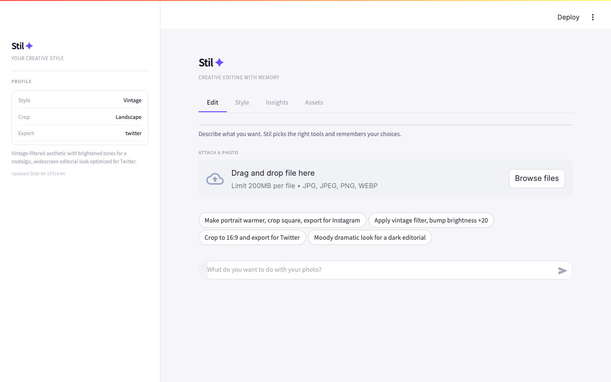
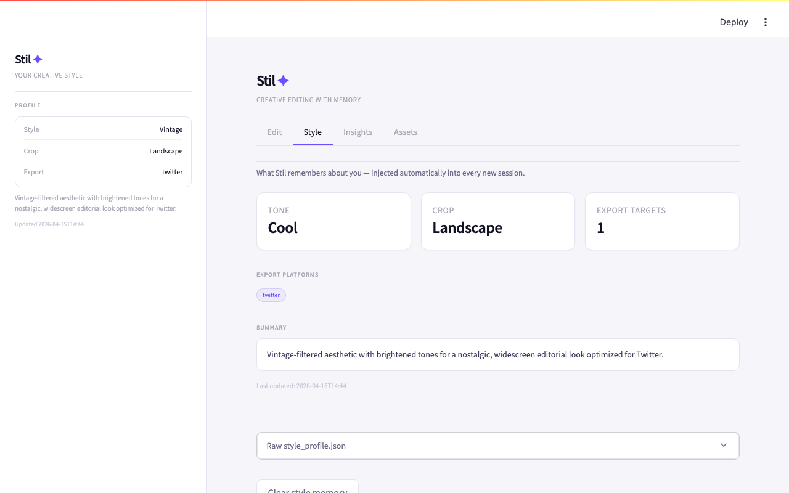
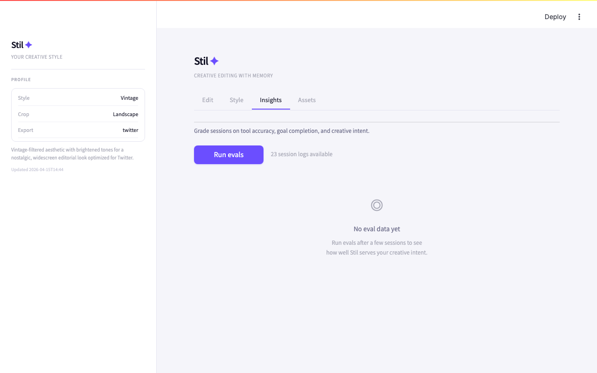
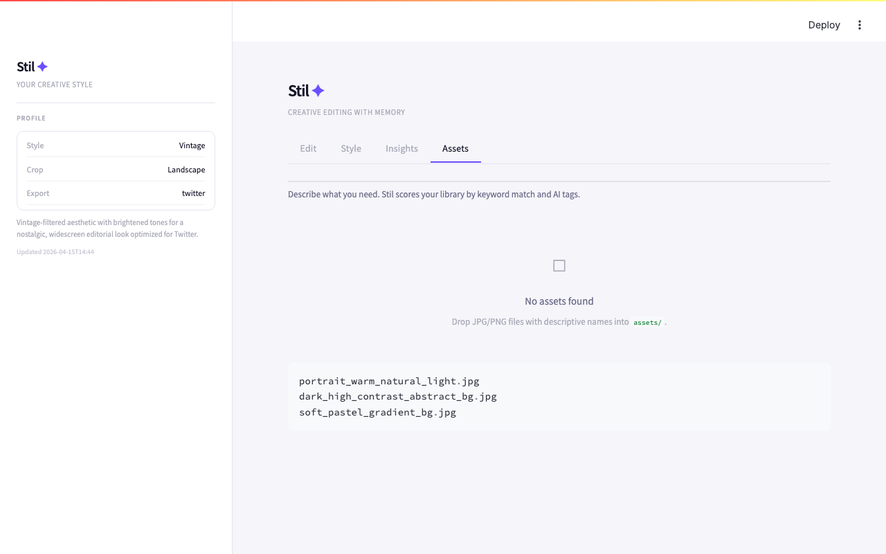

# Stil ✦

**Your creative style, remembered.**

Stil is a conversational AI assistant for content creators and brand designers.
It learns your visual preferences — tone, crop ratios, export presets, aesthetic —
and applies them automatically every session without re-explanation.

---

## Screenshots

### Edit — conversational editing with multimodal vision


### Style — your persistent style profile and choices log


### Insights — session quality grader


### Assets — natural language image search


---

## The problem in one sentence

Every AI tool you open treats you like a stranger, even after years of use.

You have a look. Warm tones. Square crops. Instagram exports. You've made these
decisions hundreds of times. But Lightroom presets don't follow you to Canva.
Canva templates don't follow you to CapCut. And every AI assistant you try
starts from zero every single session.

**Stil is the memory layer that sits across all of it.**

---

## What it does

| Capability | What happens |
|---|---|
| **Conversational editing** | Describe what you want. Stil picks the right tools and executes. |
| **Style memory** | Preferences extracted silently after every session. Never re-explain. |
| **Choices log** | Every filter, crop, and export choice is logged. Most recent wins. |
| **Multimodal** | Upload a photo. Stil sees it and carries it across the whole conversation. |
| **Smart asset search** | Describe what you need. Stil scores your library by keyword and AI tags. |
| **Quality insights** | Sessions graded on tool accuracy, goal completion, and creative intent. |

---

## Setup (5 minutes)

```bash
# 1. Clone and install
git clone https://github.com/bnamatherdhala7/FF-Stil.git
cd FF-Stil/stil
pip install -r requirements.txt

# 2. Add your API key
cp .env.example .env
# Open .env and paste your Anthropic API key
# Get one at: https://console.anthropic.com

# 3. Add some photos to assets/ (optional)
# Download free images from unsplash.com
# Name them descriptively: portrait_warm_natural_light.jpg

# 4. Run
streamlit run app.py
# Opens at http://localhost:8501
```

---

## How to use it

**First session:**
1. Open the **Edit** tab
2. Upload a photo (drag and drop or browse)
3. Type: *"Make this warmer, crop it square, export for Instagram"*
   — or pick one of the sample prompt chips
4. Watch Stil execute the tools in real time (firing → resolved pills)
5. Your preferences are saved automatically to the sidebar

**Every session after:**
1. Upload a photo (or continue with the same one — it stays in context)
2. Type: *"Edit this"*
3. Stil applies your remembered style from the choices log — no re-explanation

**Style tab** — see your full style profile: tone, crop, export targets, aesthetic summary.
Raw `style_profile.json` is always visible. Clear memory anytime.

**Insights tab** — run evals after a few sessions. Three-dimension graded scorecard:
tool accuracy, goal completion, and creative intent. Plain-English health summary.

**Assets tab** — search your image library in plain language:
*"high contrast background for a social post"*

---

## How style memory works

```
Session ends
    ↓
Two things happen in parallel:
  1. choices_log updated — deterministic, from actual tool calls
     (apply_filter("dramatic") → logs filter: dramatic)
  2. style_signature updated — AI-extracted from conversation text

Next session system prompt:
  Priority 1: choices_log[0]  ← most recent explicit tool choice (ground truth)
  Priority 2: style_signature ← AI-inferred tone/aesthetic
```

The choices log is the ground truth layer. If you switch from warm to dramatic,
the log captures the change immediately from the tool call — no AI inference needed.

---

## Architecture

```
app.py             Streamlit UI — 4 tabs, real-time streaming tool pills, choices log sidebar
agent.py           Agentic loop — Claude + tools + style memory + vision + conversation history
creative_tools.py  5 editing functions: filter, brightness, crop, export, layers
asset_library.py   MCP asset server — list, inspect, tag, find
insights.py        Session grader — 3-dimension rubric + health summary
style_profile.json Auto-created after first session (gitignored)
assets/            Your image library
logs/              JSONL session logs (gitignored)
docs/screenshots/  UI screenshots
```

**Model usage:**

| Task | Model | Why |
|---|---|---|
| Agent loop | claude-haiku-4-5 | Fast, cheap, responsive |
| Style extraction | claude-haiku-4-5 | Tiny structured prompt |
| Insights grading | claude-haiku-4-5 | One call per turn |
| Asset tagging | claude-haiku-4-5 | Cached — never re-run |

Target cost: **< $0.05 per user per day** at moderate usage.

---

## Asset naming convention

The filename is the search index. No database, no embeddings.

```
portrait_warm_natural_light.jpg
dark_high_contrast_abstract_bg.jpg
soft_pastel_gradient_bg.jpg
warm_golden_hour_outdoor.jpg
bright_colorful_flat_lay.jpg
```

Words in the filename match natural creative briefs.
Free images at [unsplash.com](https://unsplash.com) — download, rename, drop in.

---

## Roadmap

| Version | Focus |
|---|---|
| v0.1 (now) | Local prototype — style memory, choices log, multimodal vision, asset search, insights |
| v0.2 | Richer style model — colour palette extraction, mood tags, better onboarding |
| v0.3 | Real integrations — Canva Apps SDK, Cloudinary API (Lightroom requires Adobe partnership) |
| v0.4 | Multi-brand — multiple style profiles, client brand switching |
| v0.5 | Web app + mobile — hosted, Supabase storage, mobile-first UI |

---

## Contributing

See [CLAUDE.md](CLAUDE.md) for the full architecture guide and development rules.
See [PRD.md](PRD.md) for the full product requirements and strategy.
See [COMPETITORS.md](COMPETITORS.md) for the competitive landscape analysis.

Built with [Anthropic Claude](https://anthropic.com) · [Streamlit](https://streamlit.io) · [FastMCP](https://github.com/jlowin/fastmcp)
